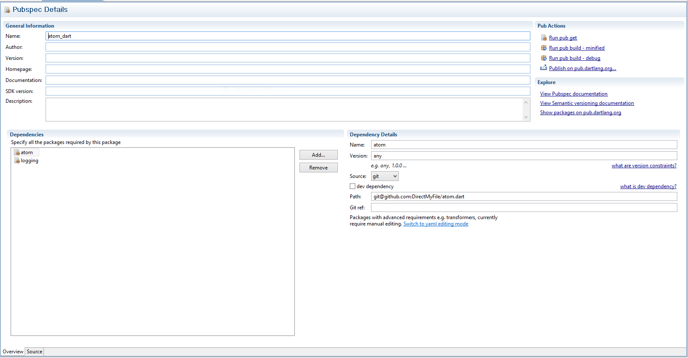

# Atom Dart Design Doc

## Requirements

1. Provide code-completion for Dart code and pubspec.yaml
  files.
2. Provide syntax highlighting for Dart code, Dart documentation comments, and
  pubspec.yaml files.
3. Provide refactoring functions for Dart code.
4. Provide the ability to run Dart packages and show their
  output in the editor.
5. Allow for debugging of running Dart programs in the editor.
  1. Allow for setting break points visually in the editor
  2. Allow for stepping through code
  3. Allow for viewing values of variables in the running program
6. Allow the user to view an outline of the structure of a
  Dart source code file.

## Design

### Analysis Server Integration

The analysis server is

### PubSpec Details

